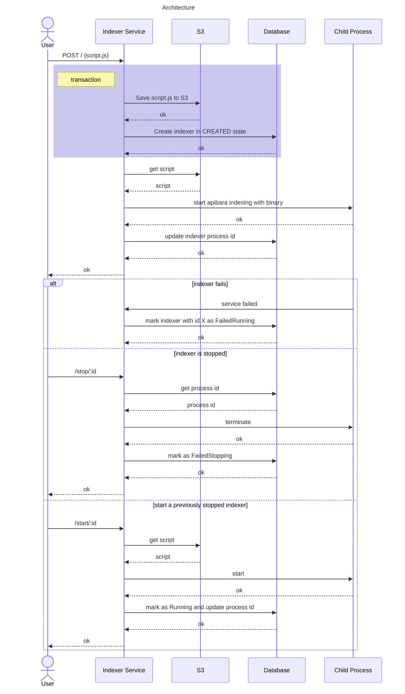

# Indexer Service

This service is a way to create indexers on-demand using [apibara](https://www.apibara.com/docs).

[](https://codecov.io/gh/Astraly-Labs/indexer-service)

## Architecture



## Running locally

1. Run docker compose `docker compose -f compose.dev.yaml up --build`

2. Initialize bucket `make gcs-init`

3. Create an indexer locally e.g
```bash
curl --location 'http://0.0.0.0:8081/v1/indexers' \
--form 'script.js=@"/Users/0xevolve/Documents/GitHub/indexer-service/examples/pragma/mainnet/mainnet-script-spot.js"' \
--form 'table_name="mainnet_spot_entry"' \
--form 'indexer_type="Postgres"' \
--form 'starting_block="1000000"'
```

4. Check status with
```bash
curl --location 'http://0.0.0.0:8081/v1/indexers/status/table/mainnet_spot_entry'
```

## Running tests

1. Run docker compose `docker compose -f compose.dev.yaml up --build`

2. Run tests with `cargo nextest run --test-threads=1`