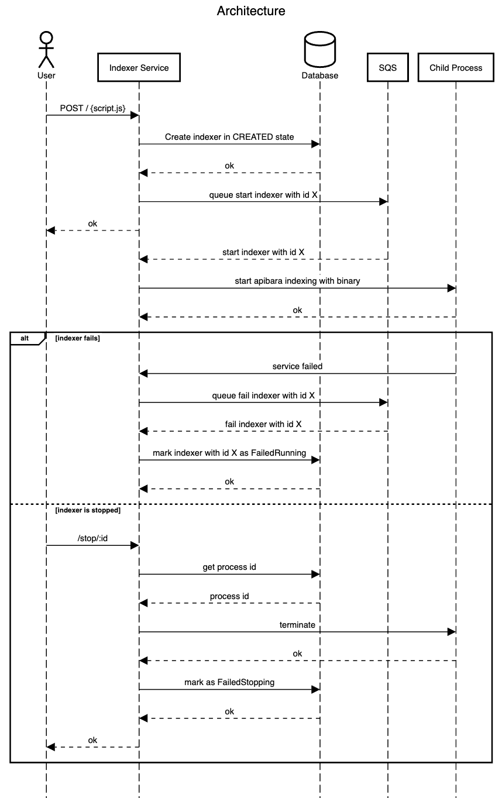

# Indexer Service

This service is a way to index on any event on the blockchain via an API.

## Architecture

## Setup

1. Set AWS environment variables
2. Download the bin file
3. Create SQS queue
